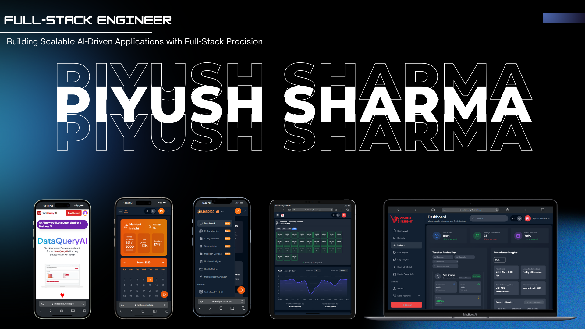

<!-- Header Image -->

  

<!-- Animated Header -->

  

  
  
  
  

---

## 🌟 **Who Am I?**
🚀 **A passionate Full-Stack Developer & AI Enthusiast** from India, who loves:  
✔️ Building scalable, AI-powered web applications  
✔️ Exploring Machine Learning & Deep Learning models  
✔️ Working on innovative projects with real-world impact  

- 🔭 Currently developing **AI-driven financial & healthcare solutions**
- 🌱 Learning **Cloud Computing, DevOps, MLOps & Scalable Architectures**
- 🎯 Interested in **AI, Blockchain, and Open Source Development**
- 🎬 When I'm not coding, I'm into **Movies, Reading & Gaming** 🎮

---

## 🛠 **Tech Stack & Tools**

  

---

## 🚀 **GitHub Stats & Activity**

    

  
  
  

---

## 🔥 **Top Projects**
### 🔹 [Vision Insight](http://visioninsight.vercel.app/)
📌 **Next.js, TypeScript, Django, TensorFlow, YOLO, Node.js**  
🔹 AI-powered campus optimization platform with **real-time monitoring** and **CCTV integration**.  
🔹 Improved **student density analysis** by **35%** with an advanced heatmap system.

### 🔹 [Medigo AI](https://medigox.vercel.app/)
📌 **Next.js, TypeScript, TensorFlow, LLM Models**  
🔹 AI-powered healthcare platform integrating **medical imaging analysis** & **telemedicine**.  
🔹 Achieved **92% accuracy** in ML-based **X-ray anomaly detection**.

---

## 🌍 **Social & Community Engagement**
💡 I actively contribute to **open-source projects** and **tech communities**:  
✔️ Contributor to **AI & Full Stack Hackathons** 🏆  
✔️ Writing blogs on **Medium & Dev.to** ✍️  
✔️ Engaging with **Tech Twitter & LinkedIn Community**  

---

## 🤝 **Let's Connect!**
💬 Feel free to reach out if you have **exciting projects, ideas, or collaborations in AI & Full Stack Development.**  

  
  

---

## 🎯 **Fun Facts About Me**
🎵 I enjoy coding with **lo-fi beats** playing in the background.  
🚀 I believe **"Technology should solve real-world problems."**  
🎮 I'm an absolute **sucker for open-world RPG games!**  

---

## 📊 **Profile Visitor Count**

  

